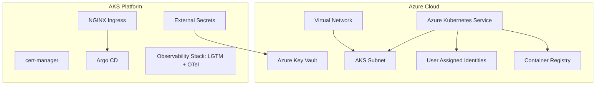

# Enterprise Cloud Infrastructure & Platform (AKS & GitOps)

A production-ready infrastructure-as-code (IaC) and cloud native application platform on Microsoft Azure. It automates the provisioning of core networking, container registries, AKS clusters, key vaults, workload identity, and bootstrapping of a complete GitOps/observability platform.

## Architecture Overview



---

## Directory Structure

```text
├── .github/workflows/       # CI/CD pipelines
│   └── terraform.yml        # Terraform format, lint, validate, plan, and apply workflow
├── bootstrap/               # Base deployment identity and state store configuration
├── environments/            # Target deployment environments
│   └── azure/dev/           # Dev environment root module
├── modules/                 # Reusable HCL modules
│   └── azure/
│       ├── acr/             # Azure Container Registry
│       ├── aks/             # Azure Kubernetes Service
│       ├── keyvault/        # Azure Key Vault
│       └── network/         # Core VNet and NSGs
└── kubernetes/              # Helm value maps and platform configurations
    ├── argocd/              # Argo CD parameters and ingress
    ├── cert-manager/        # TLS certificate management values
    ├── external-secrets/    # Key Vault integration values and manifests
    ├── ingress-nginx/       # Ingress controller configuration
    ├── observability/       # LGTM Stack (Loki, Prometheus, Tempo) and OTel Collector values
    └── install.ps1          # Kubernetes platform installation script
```

---

## Getting Started

### 1. Azure Login
Authenticate with your target subscription:
```bash
az login
az account set --subscription "<subscription-id>"
```

### 2. Infrastructure Deployment (Local Development)
To validate and deploy HCL configuration:
```bash
cd environments/azure/dev
terraform init
terraform plan
terraform apply
```

### 3. Kubernetes Platform Integration
Register helm repositories and install the base platform components (Ingress, Cert-Manager, Secrets, Argo CD, Observability Stack):
```powershell
.\kubernetes\install.ps1
```

---

## Platform Components

* **Argo CD**: Exposed via NGINX Ingress at `http://<load-balancer-ip>` (Port `80`).
* **External Secrets**: Interacts via Azure Workload Identity to fetch secrets from Azure Key Vault and synchronize them into Kubernetes namespace secrets.
* **Observability Stack**:
  * **Prometheus & Grafana**: Metric monitoring.
  * **Loki**: Log collection.
  * **Tempo**: Trace visualization.
  * **OpenTelemetry Collector**: Unified ingestion and pipelines.
